# Django Blog

### [Demo Video](https://drive.google.com/file/d/1kw9WxeZyBFLrfbk_XoFEPdk4y4NFVdjT/view?usp=sharing) 

# Table of contents

- [Steps for running the Project](#steps-for-running-the-project)

- [Navigate our Blog](#navigate-our-blog)

- [Features](#features)

- [TO DOs](#to-dos)

- [Who we are](#who-we-are)

- [Members Contribution](#members-contribution)

## Steps for running the Project  

1. Clone This Project (Make Sure You Have Git Installed):

  `git clone https://github.com/OmarAbdelzaher/Django-Blog-Project-G1.git`

2. Open mysql or any database manager you want ex: postgres, sqlite (Django Default) and create your own database

3. Set the database type in `settings.py` to mysql and set the database name
    - In case you logged in mysql as root, you don't have to specify your username and password to the database in `settings.py`
    - In case you logged in as a user, you have to specify your username and password to the database

    

4. Set Database (Make Sure you are in directory same as manage.py):

  `python manage.py makemigrations`

  `python manage.py migrate`

5. Create SuperUser to access admin page:

  `python manage.py createsuperuser`

6. Run the server:

  `python manage.py runserver`

7. Enter your browser http://localhost:8000/dj_blog/landing. Also, you can login via admin in http://localhost:8000/admin/

Then you are Good To Go ...

## Navigate our Blog

### Registration and Login

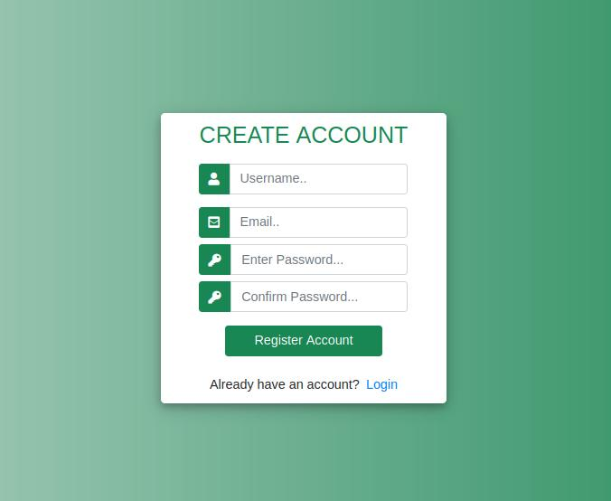

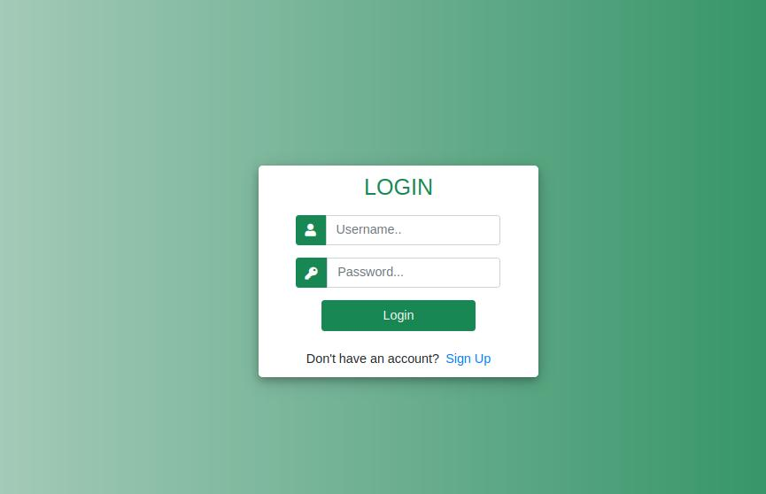

### Landing page

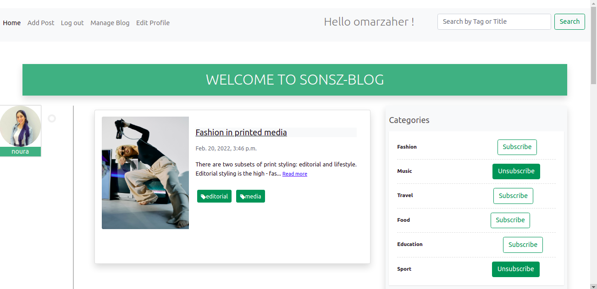

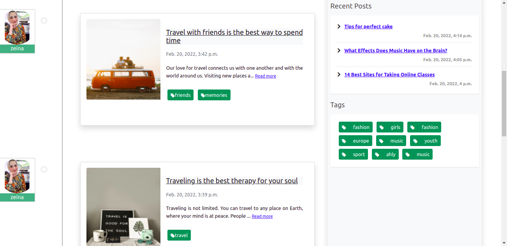

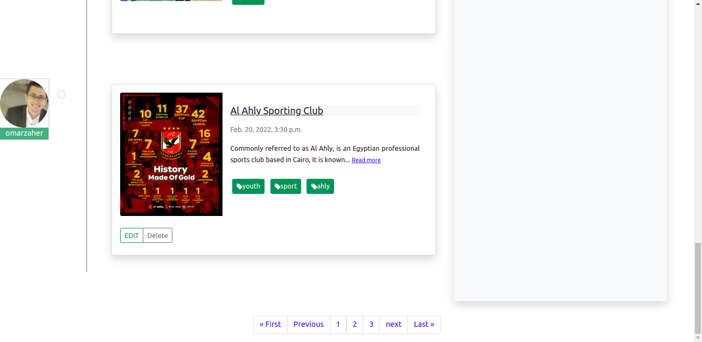

### Categories page

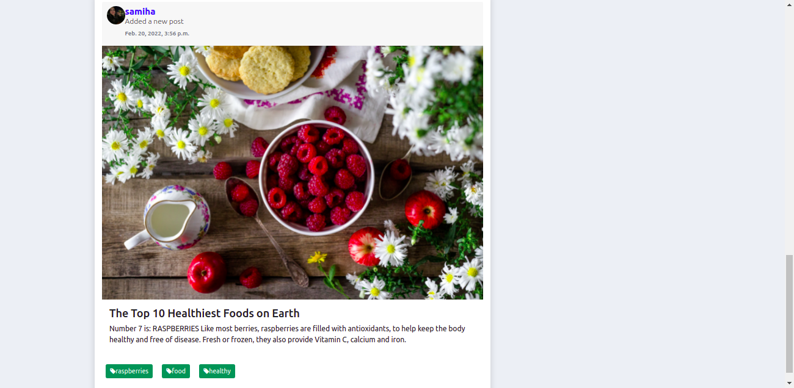

### Post page

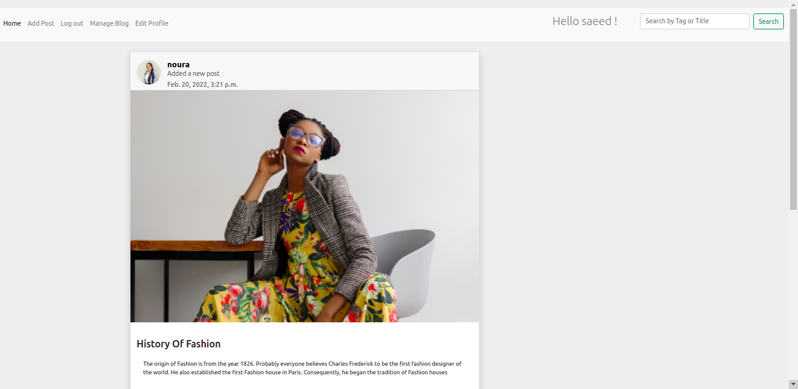

### Comments and Forbidden words

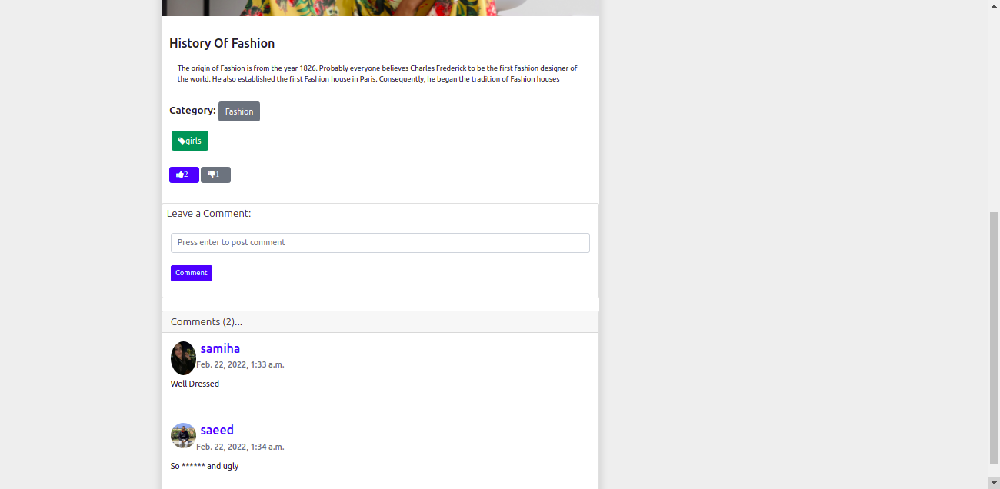

### Edit Profile Picture

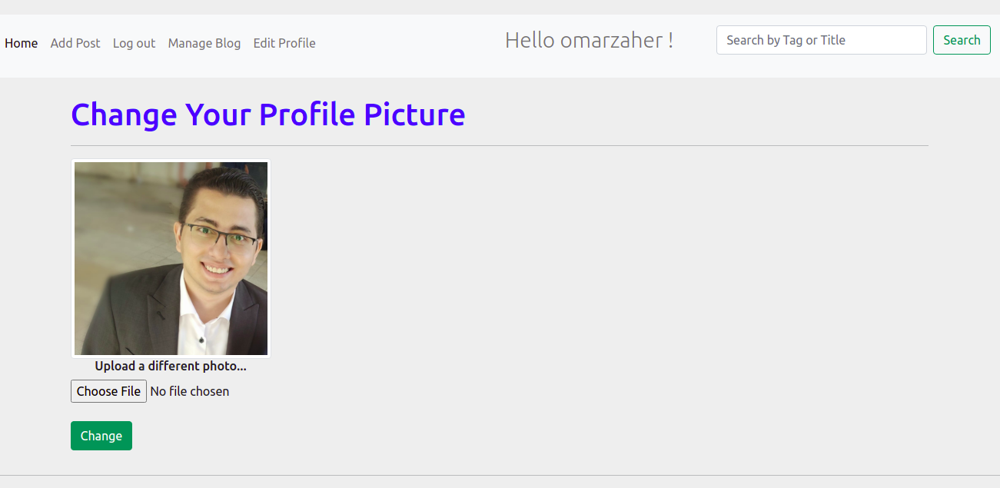
### Search result

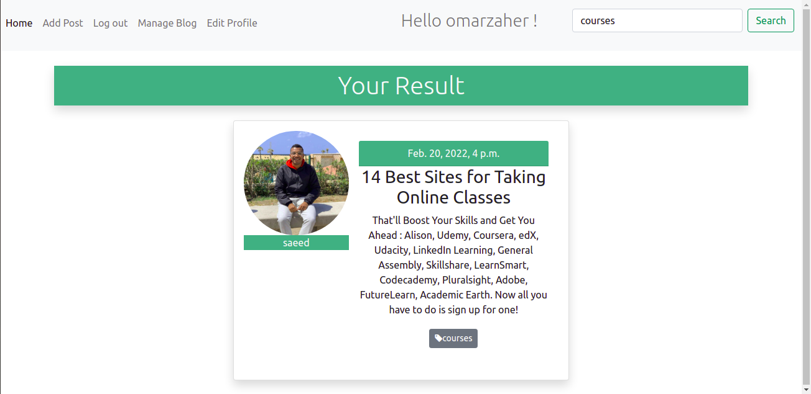

### Email Subscription for a category:

### Admin Login

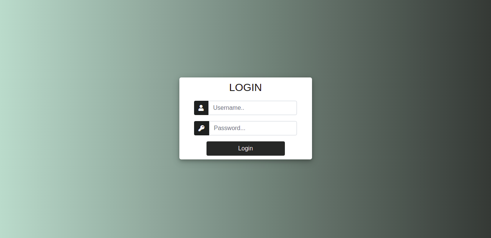

### Admin Page

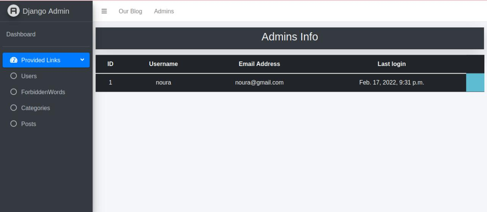

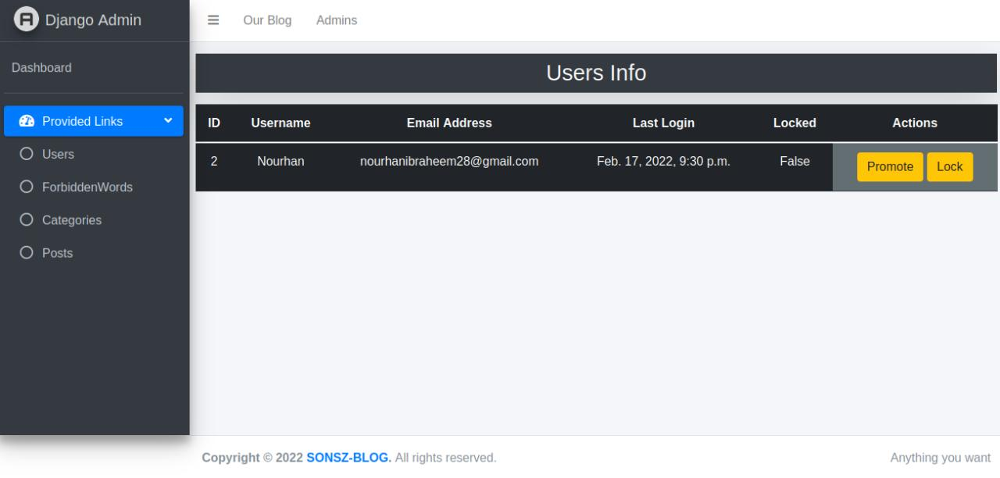

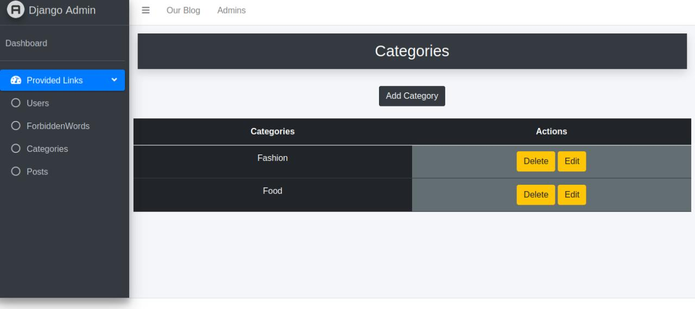

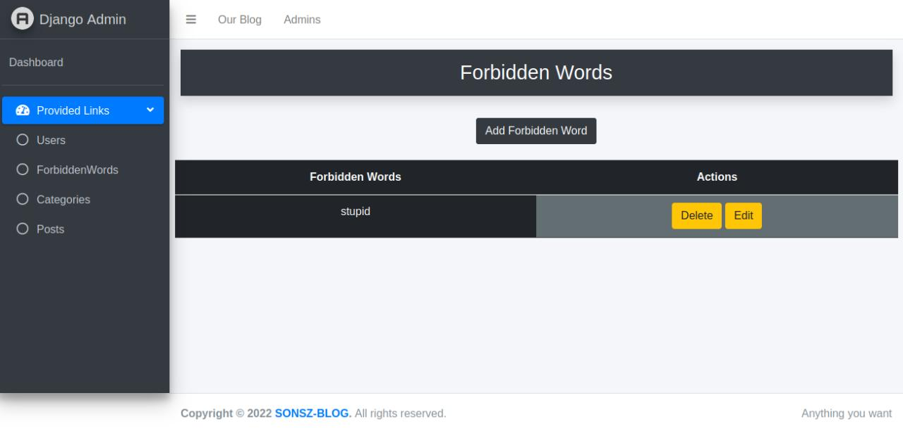

#### Admin CRUD Operations

##### Add & Edit Posts
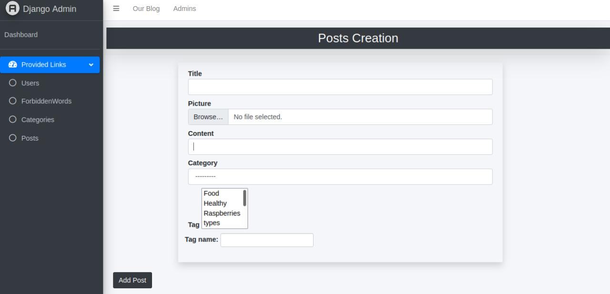

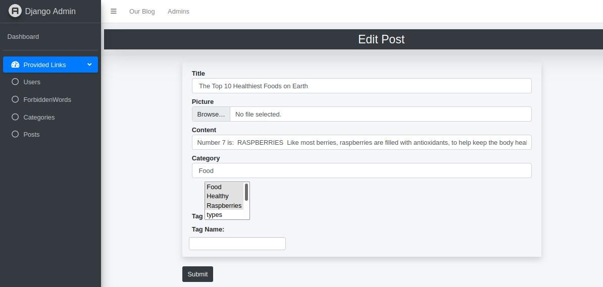

##### Add & Edit Categories
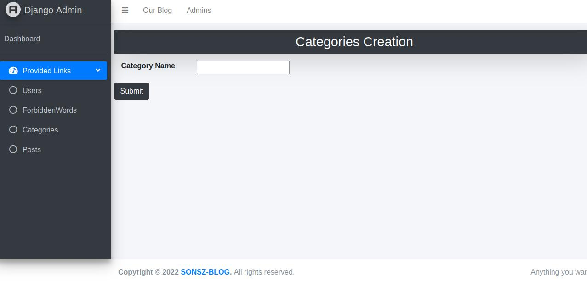

##### Add & Edit Forbidden Words

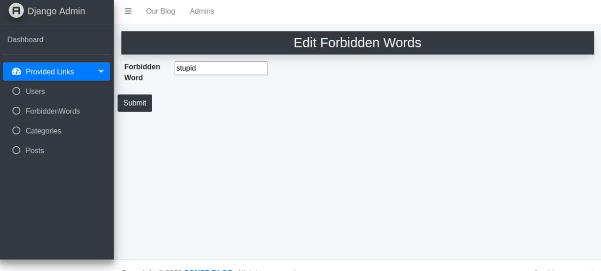

## Features

### - Header (NavBar)
- It contains links Login/Register

- If the user is already logged in, then the link will be Logout

- If the logged-in user is an admin, then there will be another link called Manage Blog that will redirect the admin to the administration page to make the admin CRUD Operations

- The user can find a search input where he can search by tags or titles of the posts

### - Sidebar
- It contains all the available categories. (example: Sports, News, Politics, ...) with a button beside them be subscribe or unsubscribe if the user is already subscribed to this category

- When a category is chosen it will be redirected to a page that contains all the posts belonging to this category

- The posts are sorted by date of publish

- When click on subscribe to a category, a confirmation email would be sent to the user with this message (Hello "user name" you have subscribed successfully in "category name")

### - Body
- It has the top posts sorted by publish date
- When clicking on the image of a post, it will redirect to the post’s
page

### - Footer
- It has a pagination part where each page contains only the top
5 posts sorted by publish date.
- When clicking on Next it will get the next 5 posts

### - Registration Page
- It is a form that takes:
  - Username
  - Email
  - Password
  - Password Confirmation

### - Login Page
  - The form contains 2 fields: Username and Password

  - The password is shown in asterisks

  - When the user clicks on login, if he is blocked then redirect him back to the login page with a message (sorry you are blocked contact the admin) if he is not blocked then he will be authenticated

### - Post Page Content

  - Title
  - Post Picture
  - Content of the post
  - The category that this post is under
  - Tags related
  - Comments section

### - Post Page Characteristics
  - Each comment shows the time of the comment and the
  username who wrote the comment

  - User must be signed in to be able to submit a comment (enter the text and a submit button to submit the comment)

  - If the comment contains inappropriate words, it will show like ******** with the length of the undesired word. For example:

  [ ‘stupid’ → \****** ]

  [ ‘fool’ → **** ]

  - Like and dislike counter on the posts
  - If a post counted more than 10 dislikes it will be auto-deleted

### - Normal User Characteristics
  - He can see posts and categories

  - Search by tag name, post title

  - If logged in he can like, dislike, comment on a post

  - If blocked, he cannot log into the system on the login page
  (**Your account is locked, please contact an admin**)

### - Admin User Characteristics
  - Admin users can make CRUD on posts

  - Admin users can make CRUD on categories

  - Admin users can block or unblock users

  - Admin users can promote a normal user to an admin user so that he will be able to log into the admin screen

  - Admin users can CRUD on forbidden words

  - The Admin page contains links: users, posts, categories, forbidden

  - When Admin clicks on the Posts Link, it would list all posts, with links to edit, delete and create

  - The same will be applied to categories, forbidden words

  - When Admin clicks on Users Link, it would list all the users

  - There is an option to list all admins

  - For normal users, there should be a button that enables the admin to either lock or unlock this user from logging into the system and for the Admin users, this button is not available So, an admin cannot lock another admin

  - A security feature is added too, a must login to admin pages in order to prevent lucky guessing to admins' urls

## TO DOs
  - A reply to each Comment
  - Likes and Unlikes to comments and replies

## Who we are
- ITI Students & Teammates, we are a Full Stack Web Development students at ITI - Python Back-end Track

- We are introducing a Django Blog with many features using Django Templates as a front-end and mysql as a database manager

Name | Email
------------ | -------------
Nourhan Ibraheem | nouraibraheem82@gmail.com
Samiha Hesham | samihahesham9@gmail.com
Saeed Adel | sashsadel7@gmail.com
Omar Abdelzaher | omarzaher787@gmail.com
Zeina Ayman | zeinaayman14@gmail.com

## Members Contribution
Features/Name | Noura | Samiha | Saeed | Omar | Zeina
------------ | -------- | --------| --------| --------| --------
Header|:heavy_check_mark:||||:heavy_check_mark:
Sidebar|:heavy_check_mark:||||:heavy_check_mark:
Email|:heavy_check_mark:||:heavy_check_mark:||  
Body|:heavy_check_mark:|:heavy_check_mark:|||:heavy_check_mark:
Footer|||||:heavy_check_mark:
Registration|||:heavy_check_mark:||
Login|||:heavy_check_mark:||
Posts||:heavy_check_mark:||:heavy_check_mark:|
Comments||:heavy_check_mark:||:heavy_check_mark:|
Forbidden Words|||:heavy_check_mark:||
Likes-Dislikes||:heavy_check_mark:||:heavy_check_mark:|
Auto-Delete-Post|||||:heavy_check_mark:
Search|:heavy_check_mark:||||
User-CRUD||||:heavy_check_mark:|:heavy_check_mark:
Admin-CRUD|||:heavy_check_mark:|:heavy_check_mark:|
Block-Promote|||:heavy_check_mark:||
Edit-Profile||:heavy_check_mark:||:heavy_check_mark:|:heavy_check_mark:
Admin-Security|||:heavy_check_mark:||
